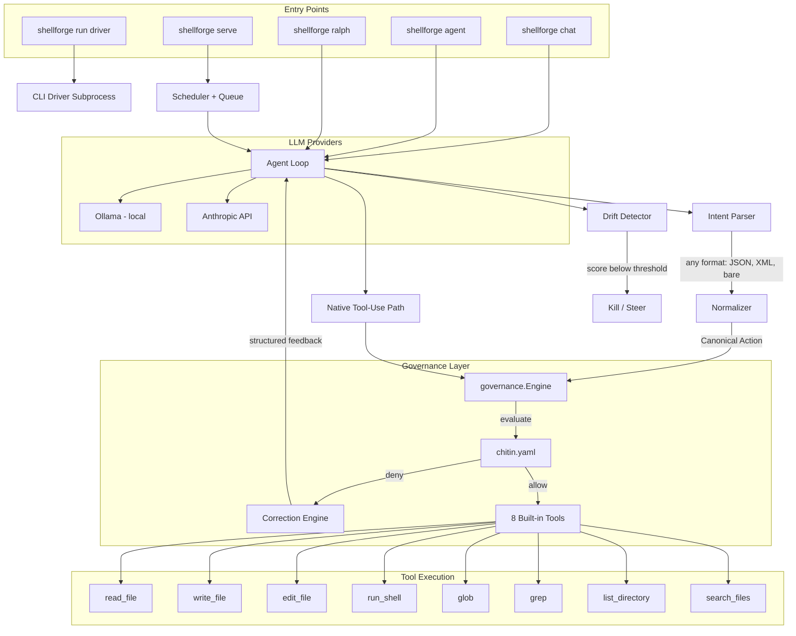

<div align="center">

# ShellForge

**Governed AI agent runtime -- single Go binary, local or cloud models.**

[](https://go.dev)
[](LICENSE)
[](https://github.com/chitinhq/chitin)


</div>

## Architecture



## Getting Started

### Prerequisites

- Go 1.18+ (for building from source)
- [Ollama](https://ollama.com) for local model inference, or an Anthropic API key for cloud

### Install

From source:

```bash
git clone https://github.com/chitinhq/shellforge.git
cd shellforge
go build -o shellforge ./cmd/shellforge/
```

Or via Homebrew:

```bash
brew tap chitinhq/tap
brew install shellforge
```

### Quick Start

```bash
# Pull a model and start Ollama
ollama pull qwen3:8b
ollama serve

# Initialize governance in your project
cd ~/your-project
shellforge setup

# Interactive pair-programming
shellforge chat

# One-shot agent task
shellforge agent "describe what this project does"

# Multi-task loop with validation
shellforge ralph tasks.json --validate "go test ./..."
```

## CLI Commands

| Command | Description |
|---------|-------------|
| `shellforge chat` | Interactive REPL with persistent conversation history |
| `shellforge agent "prompt"` | One-shot governed agent execution |
| `shellforge ralph tasks.json` | Stateless-iterative multi-task loop (pick, implement, validate, commit) |
| `shellforge run <driver> "prompt"` | Run a governed CLI driver (claude, copilot, codex, gemini, openclaw, nemoclaw) |
| `shellforge serve agents.yaml` | Daemon mode -- memory-aware agent scheduling |
| `shellforge setup` | Create governance config and verify stack |
| `shellforge status` | Ecosystem health check |
| `shellforge qa [dir]` | QA analysis with tool use |
| `shellforge report [repo]` | Status report from git + logs |
| `shellforge scan [dir]` | DefenseClaw supply chain scan |
| `shellforge canon "cmd"` | Parse shell command into canonical JSON |

### Provider Flags

```bash
shellforge chat --provider anthropic          # Cloud model via Anthropic API
shellforge chat --model qwen3:14b             # Specific Ollama model
shellforge agent --thinking-budget 8000 "prompt"  # Extended thinking (Sonnet/Opus)
```

## Governance

Every tool call passes through the governance engine before execution. Policies are defined in `chitin.yaml`:

```yaml
mode: enforce   # enforce | monitor

policies:
  - name: no-force-push
    action: deny
    match:
      command: "git push"
      args_contain: ["--force"]

  - name: no-destructive-rm
    action: deny
    match:
      command: "rm"
      args_contain: ["-rf"]
```

When a tool call is denied, the correction engine feeds structured feedback back to the model so it can self-correct rather than simply fail.

## Key Internals

| Package | Purpose |
|---------|---------|
| `internal/agent` | Core agent loop with tool calling, drift detection, context compaction |
| `internal/governance` | Policy engine -- evaluates every action against `chitin.yaml` |
| `internal/correction` | Escalating feedback for denied actions (retry budget + structured hints) |
| `internal/intent` | Format-agnostic intent parser (JSON, XML, bare JSON, OpenAI function_call) |
| `internal/normalizer` | Converts any tool call into a Canonical Action Representation |
| `internal/llm` | Provider interface with Anthropic (prompt caching, native tool-use) and Ollama backends |
| `internal/tools` | 8 governed tools: read, write, edit, glob, grep, shell, list, search |
| `internal/ralph` | Stateless-iterative task loop with validation and auto-commit |
| `internal/repl` | Interactive REPL with color output, shell escapes, signal handling |
| `internal/scheduler` | Memory-aware agent queue for daemon mode |
| `internal/orchestrator` | Sub-agent orchestration with context compression |

## Development

```bash
go build ./cmd/shellforge/
go test ./...
golangci-lint run
```

## Part of the Chitin Platform

ShellForge is the local governed agent runtime. Other repos:

| Repo | Role | Start here if you want to… |
|------|------|------------------------------|
| [chitin](https://github.com/chitinhq/chitin) | Governance kernel — policy, invariants, hooks | Gate an agent you already use |
| **shellforge** (this repo) | Local governed agent runtime | Run a governed agent end-to-end |
| [octi](https://github.com/chitinhq/octi) | Swarm coordinator — triage, dispatch, routing | Orchestrate multiple agents |
| [sentinel](https://github.com/chitinhq/sentinel) | Telemetry + detection on agent traces | Analyze how agents fail |
| [llmint](https://github.com/chitinhq/llmint) | Token-economics middleware for LLM providers | Control LLM cost in Go apps |

New to the platform? See [chitin's GETTING_STARTED.md](https://github.com/chitinhq/chitin/blob/main/GETTING_STARTED.md).

## License

MIT
